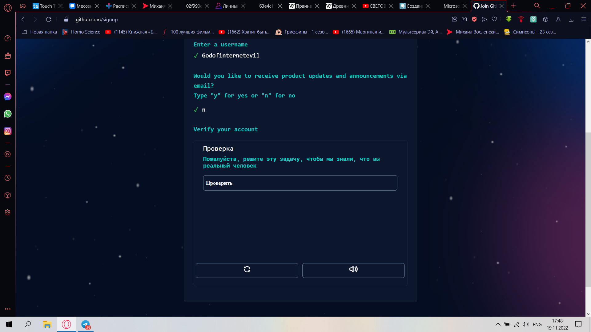
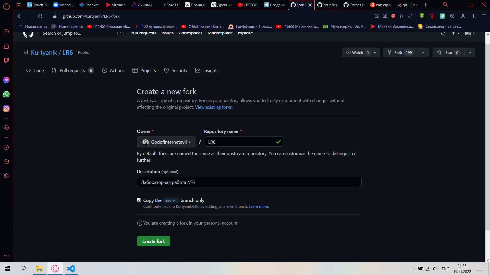
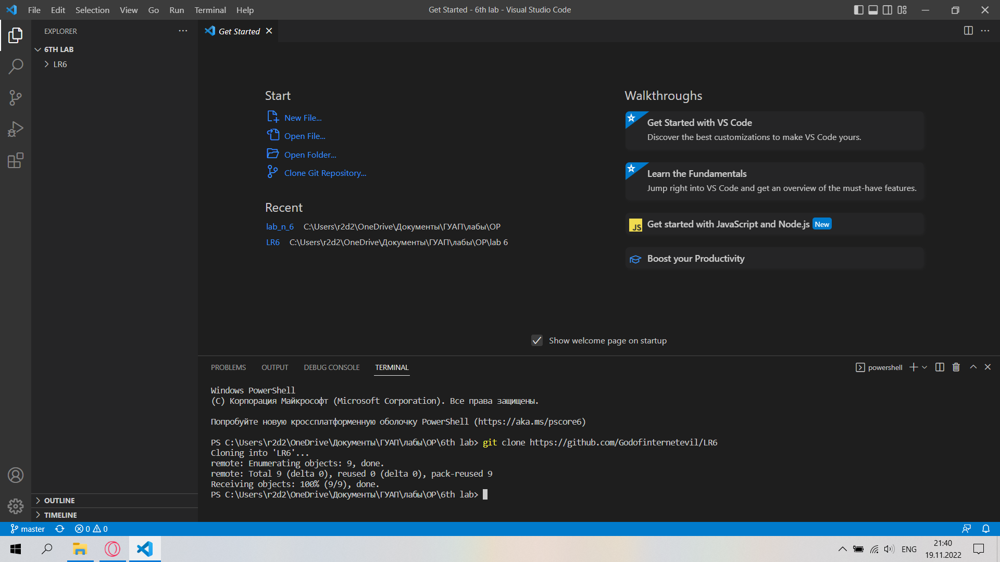
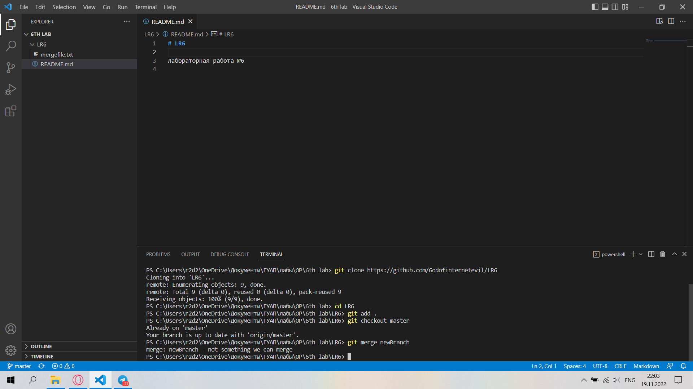
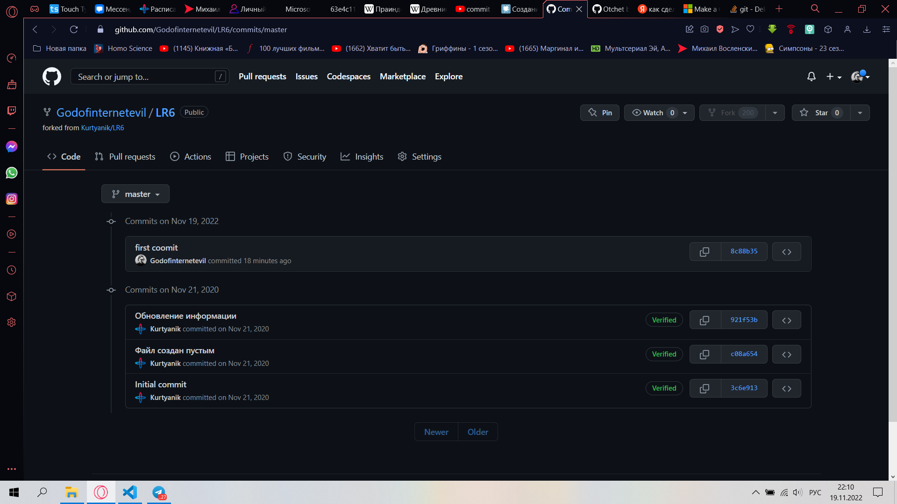
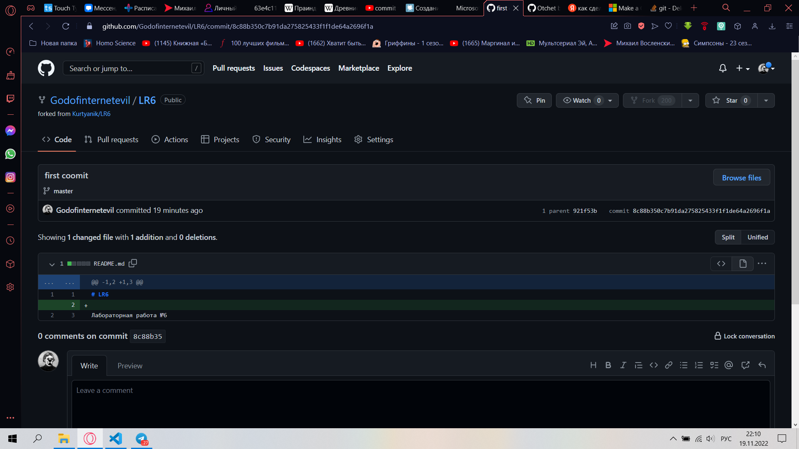
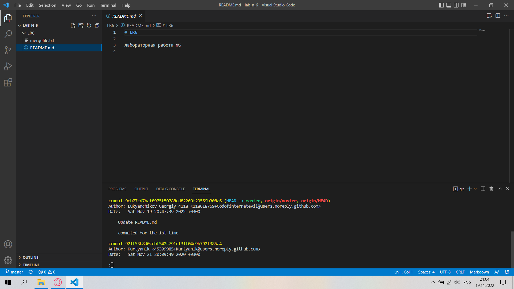
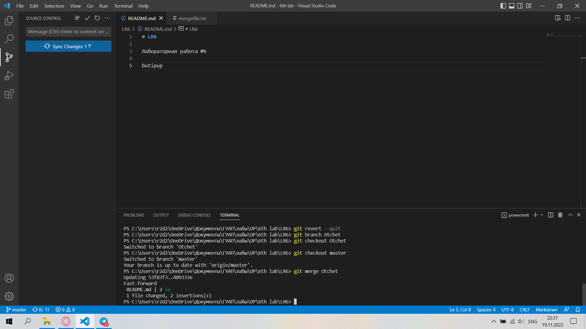
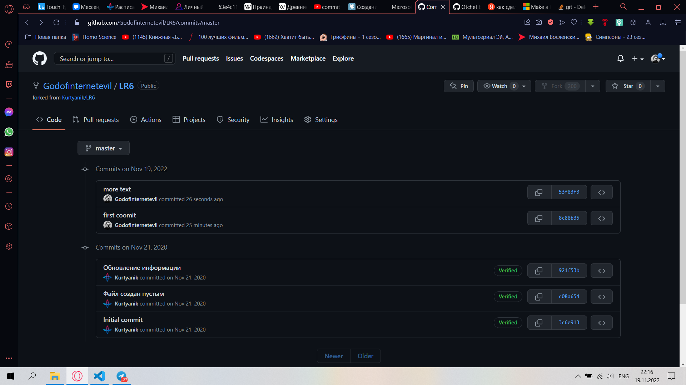
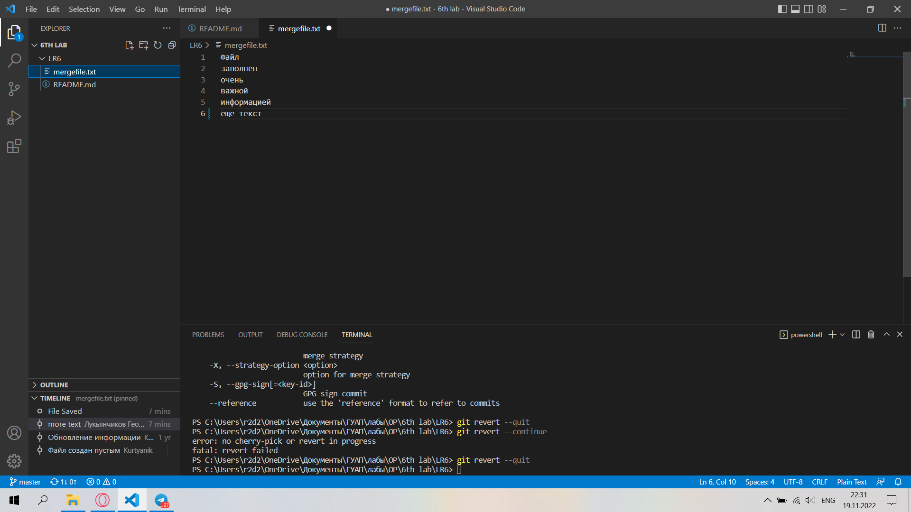

# LR6

Лабораторная работа №6

# 
LR6

# 
Лабораторная работа №6

**Цель работы:** _изучение базовых возможностей системы управления версиями, опыт работы с Git Api, опыт работы с локальным и удаленным репозиторием._

1. Создание аккаунта на `GitHub`, присвоение имени.

   

##### 
_Создание аккаунта и присвоение ему имени._

2. Форк репозитория преподавателя.

##### 
_Рисунок 2. Fork._

3. Клонирование репозитория в `VS code`.
   

##### 
_Рисунок 3. Клонирование репозитория._

4. **stage** файлов при помощи команды `"git add ."`.
   

##### 
_Рисунок 4. Stage файлов._

5. `commit` с комментарием, пулл.

   

##### 
_Рисунок 5. Commit._

   

##### 
_Рисунок 6. Commit._

6. При помощи `"git log"` запрашиваем список изменений ветки.
   

##### 
_Рисунок 7. Git log._

7. Сошьем нашу ветку с веткой `master`. Для этого перейдем в ветку `master` при помощи `"git checkout master"`. Затем воспользуемся командой `"git merge"`.
   

##### 
_Рисунок 8. Merge._

8. Добавим текст и зафиксируем изменения.
    

##### 
_Рисунок 9. Еще один commit._

9. Сделам откат последнего коммита при помощи `"git revert"`.
    

##### 
_Рисунок 10. Revert._

10. Создадим новую ветку `"REALotchet"` для отчета.

11. Создадим папку `"pics"`, в которую положим все скриншоты. Оформим отчет.

12. Сделаем финальный коммит и зальем на GitHub.

**Вывод:** _В лабраторной работе я научился использовать такие методы работы с git, как git add, git clone, git log, git branch, git merge, git checkout._